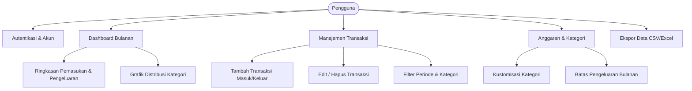
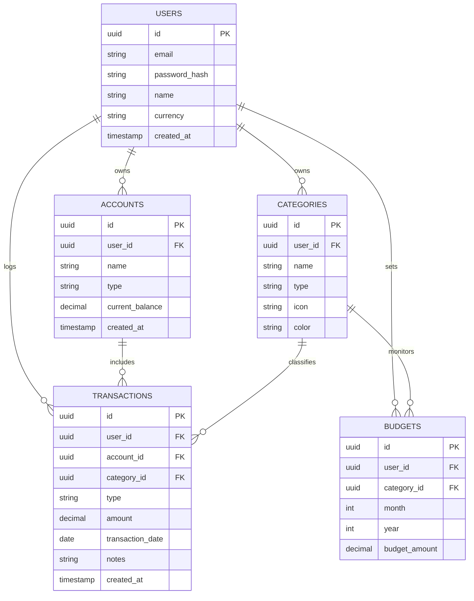

# Product Requirement Document (PRD)
## Personal Finance Tracker Web App (Pencatat Keuangan Bulanan)

---

### 1. Ringkasan Eksekutif & Latar Belakang
Banyak individu kesulitan mengontrol kondisi finansial mereka karena pencatatan arus kas harian dan bulanan yang berserakan (di nota, aplikasi chat, atau ingatan semata). Aplikasi **Personal Finance Tracker** dirancang sebagai solusi berbasis web yang intuitif, cepat, dan responsif untuk membantu pengguna mencatat pemasukan dan pengeluaran per bulan, memahami pola belanja melalui visualisasi grafik, serta menetapkan target anggaran (*budgeting*) secara disiplin.

---

### 2. Tujuan Produk & Metrik Keberhasilan

#### 2.1 Tujuan Produk
- Memudahkan pencatatan transaksi masuk dan keluar secara cepat (< 15 detik per transaksi).
- Memberikan visibilitas kondisi keuangan bulanan (Total Pemasukan, Total Pengeluaran, Saldo Bersih, dan Sisa Anggaran).
- Membantu evaluasi pengeluaran melalui kategorisasi dan grafik interaktif.

#### 2.2 Metrik Keberhasilan (Success Metrics)
- **Time to Log**: Rata-rata waktu input transaksi baru $\le 15$ detik.
- **Monthly Retention**: Pengguna aktif mencatat transaksi secara konsisten setiap minggu dalam sebulan.
- **Accuracy & Speed**: Halaman rekap dan grafik dimuat dalam waktu kurang dari 1.5 detik.

---

### 3. Persona Pengguna
- **Nama Persona**: Dimas (Karyawan / Mahasiswa / Freelancer)
- **Karakteristik**: Memiliki beberapa sumber transaksi (Rekening Bank, E-Wallet, Tunai).
- **Pain Points**:
  - Sering lupa uang habis untuk apa di akhir bulan.
  - Aplikasi yang ada terlalu rumit dengan fitur investasi/akuntansi kompleks yang tidak dibutuhkan.
  - Membutuhkan antarmuka yang bersih, cepat diakses baik lewat laptop maupun smartphone.

---

### 4. Ruang Lingkup & Kebutuhan Fungsional (Feature Requirements)

#### 4.1 Modul Autentikasi & Pengguna (Auth)
- **Registrasi & Login**: Email/Password atau integrasi OAuth (Google Login).
- **Profil Sederhana**: Pengaturan mata uang default (IDR / Rupiah), nama tampilan.
*(Catatan: Jika untuk penggunaan lokal/pribadi tanpa multi-user, tahap awal bisa disederhanakan tanpa auth kompleks).*

#### 4.2 Manajemen Transaksi (Income & Expense)
- **Pencatatan Cepat**:
  - Tipe transaksi: **Pemasukan (Income)** atau **Pengeluaran (Expense)**.
  - Jumlah nominal (dengan format mata uang otomatis Rupiah).
  - Tanggal transaksi (default: tanggal & jam hari ini, dapat diubah).
  - Kategori (misal: Makanan & Minuman, Transportasi, Tagihan, Gaji, Freelance, dll.).
  - Akun/Dompet (misal: Tunai, BCA, Mandiri, GoPay, OVO).
  - Catatan tambahan (opsional).
- **Daftar Transaksi**:
  - Tampilan tabel / list dengan paginasi atau infinite scroll.
  - Pencarian berdasarkan catatan/kategori.
  - Filter berdasarkan rentang tanggal / bulan tertentu, tipe, dan akun/dompet.
  - Aksi Edit dan Hapus transaksi.

#### 4.3 Rekap Bulanan & Dashboard Visual
- **Kartu Ringkasan (Summary Cards)**:
  - Total Pemasukan bulan berjalan.
  - Total Pengeluaran bulan berjalan.
  - Arus Kas Bersih (*Net Savings* = Pemasukan - Pengeluaran).
  - Indikator perbandingan dengan bulan sebelumnya (misal: "Pengeluaran naik 10% dibanding bulan lalu").
- **Visualisasi Data**:
  - *Donut / Pie Chart*: Persentase pengeluaran berdasarkan kategori.
  - *Bar Chart*: Tren perbandingan pemasukan vs pengeluaran harian/mingguan dalam bulan tersebut.
  - *Line Chart*: Akumulasi sisa saldo sepanjang bulan berjalan.

#### 4.4 Manajemen Anggaran (*Budgeting*) & Peringatan
- Menetapkan batas pengeluaran (*budget*) per kategori untuk bulan berjalan (contoh: Budget Makan: Rp 2.000.000).
- Progress bar pengeluaran vs budget per kategori.
- Indikator peringatan (Kuning jika sudah $\ge 80\%$, Merah jika sudah melebihi 100%).

#### 4.5 Manajemen Kategori & Dompet/Akun
- Pengguna dapat menambah, mengedit warna/ikon, dan menghapus kategori kustom.
- Pengguna dapat membuat beberapa dompet (Dompet Fisik, Bank Utama, E-wallet).

#### 4.6 Ekspor & Impor Data
- Ekspor data transaksi ke format CSV / Excel berdasarkan rentang bulan yang dipilih.
- Impor data dari file CSV untuk mempermudah migrasi data lama.

---

### 5. Kebutuhan Non-Fungsional

- **Responsiveness**: Desain antarmuka *Mobile-First*, nyaman diakses melalui peramban HP maupun desktop/laptop.
- **Kecepatan & Performa**: SPA (*Single Page Application*) atau SSR ringan dengan waktu muat halaman $< 1.5$ detik.
- **Keamanan Data**:
  - Password di-hash menggunakan algoritma aman (Bcrypt/Argon2).
  - Isolasi data pengguna (Row-Level Security jika memakai Supabase / query berparameter).
- **Penyimpanan Offline (PWA Ready)**: Opsional untuk mendukung *Progressive Web App* agar dapat di-install di layar utama smartphone.

---

### 6. Skema Basis Data (Data Model)

---

### 7. Rekomendasi Tech Stack

| Lapisan | Opsi Rekomendasi A (Modern & Fullstack) | Opsi Rekomendasi B (Simpel & Cepat) |
| :--- | :--- | :--- |
| **Frontend** | Next.js (App Router, React, Tailwind CSS) | React (Vite) + Tailwind CSS + Lucide Icons |
| **UI Components** | shadcn/ui + Radix Primitives | Tailwind UI / DaisyUI |
| **Visualisasi** | Recharts / Chart.js | Recharts |
| **Backend & API** | Next.js Server Actions / API Routes | Express.js / Fastify (Node.js) |
| **Database** | PostgreSQL / SQLite (via Prisma / Drizzle) | SQLite / Supabase |
| **Deployment** | Vercel / Railway | Vercel / Netlify + Render |

---

### 8. Rencana Tahapan Rilis (Roadmap)

#### Fase 1: MVP (Minimum Viable Product)
- [ ] Setup struktur proyek (Next.js/React + Tailwind + Database).
- [ ] CRUD Kategori & Akun/Dompet.
- [ ] CRUD Transaksi (Input pemasukan & pengeluaran bulanan).
- [ ] Tampilan list transaksi dengan filter bulan berjalan.
- [ ] Ringkasan statistik bulanan (Total Pemasukan, Total Pengeluaran, Saldo).

#### Fase 2: Visualisasi & Budgeting
- [ ] Grafik Donut pengeluaran per kategori.
- [ ] Grafik Bar perbandingan bulanan / harian.
- [ ] Fitur penetapan limit anggaran bulanan per kategori beserta progress bar.

#### Fase 3: Ekspor, Filter Lanjut, & Optimasi
- [ ] Ekspor ke CSV / Excel.
- [ ] PWA (Progressive Web App) agar dapat diakses seperti aplikasi native di smartphone.
- [ ] Pengingat / Notifikasi jika anggaran hampir habis.
